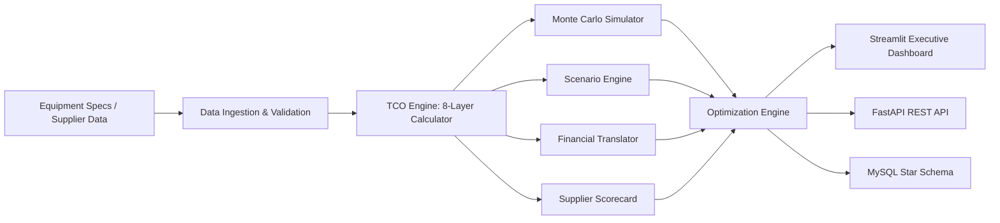

# TCO Comparison Model

Investment-grade Total Cost of Ownership analysis for machines, equipment, and spares sourced from China, India, and Europe.

## Business Problem

Capital equipment sourcing decisions across emerging and developed markets are driven by unit price, ignoring the 60–80% of lifecycle cost hidden in installation, maintenance, spares logistics, FX risk, and operational downtime. The business lacks a unified, evidence-classified model to quantify these hidden costs, stress-test them under macro scenarios, and generate prescriptive sourcing recommendations with full auditability.

## TCO Model Capabilities

- 8-Layer Deterministic TCO (acquisition through disposal)
- Monte Carlo Simulation (10,000-path stochastic uncertainty quantification)
- 6+ Scenario Engine (base, optimistic, pessimistic, regulatory shock, supply disruption, market volatility)
- Financial Translation (NPV, IRR, EBITDA impact, working capital, lifecycle cashflow)
- Supplier Scorecards (weighted multi-criteria evaluation with min-max normalization)
- Prescriptive Optimization (sourcing, maintenance scheduling via scipy, EOQ inventory, make-vs-buy)
- Industry Benchmarking (equipment reliability and regional cost percentile comparisons)
- Evidence Classification (simulated_estimate → pilot_observed → production_realized)

## Architecture Diagram



## Data Model Explanation

TCO uses a normalized star schema with equipment, supplier, and scenario dimensions.

- Fact: `fact_tco_result` (grain: one TCO computation per equipment × scenario × run)
- Dimensions: `dim_region`, `dim_supplier`, `dim_equipment`
- Results: `fact_scenario_result`, `fact_monte_carlo_result`
- Audit: `fact_audit_trail` (JSONL-backed traceability)

This structure supports lifecycle analytics, scenario comparison, and clean semantic views for BI consumption.

## TCO Cost Layer Formula

Total Cost of Ownership across 8 layers:

$$
\text{TCO} = \sum_{i=1}^{8} \text{Layer}_i = \text{Acquisition} + \text{Installation} + \text{Operating} + \text{Maintenance} + \text{Spares} + \text{Risk} + \text{Utilization} + \text{Residual}
$$

Where operating, maintenance, spares, and risk layers are present-value discounted over the asset life:

$$
\text{PV}(\text{Layer}) = \sum_{t=1}^{N} \frac{C_t}{(1+r)^t}
$$

## Monte Carlo Methodology

- Perturb base price, energy, spare cost, and disruption probability using lognormal distributions
- Simulate $N$ paths (default 10,000) through the full 8-layer TCO engine
- Report P5, P25, P50, P75, P95 with layer-level sensitivity ranking by coefficient of variation
- Evidence class: `simulated_estimate`

## Supplier Scorecard Formula

Composite Supplier Score:

$$
\text{Score} = 0.25 \cdot \text{Quality} + 0.20 \cdot \text{Delivery} + 0.15 \cdot \text{Service} + 0.15 \cdot \text{Warranty} + 0.15 \cdot \text{Price} + 0.10 \cdot \text{LocalSupport}
$$

Where each dimension is min-max normalized to $[0, 1]$ across the supplier set.

## Scenario Engine

Six predefined macro scenarios stress-testing:

| Scenario | FX Shock | Tariff Delta | Energy Escalation | Disruption Prob |
| --- | --- | --- | --- | --- |
| Base | 0% | 0% | 3% | 5% |
| Optimistic | −5% | −2% | 1% | 2% |
| Pessimistic | +10% | +5% | 8% | 15% |
| Regulatory Shock | +3% | +15% | 5% | 10% |
| Supply Disruption | +8% | +3% | 10% | 30% |
| Market Volatility | +15% | +8% | 12% | 12% |

## Business Impact (Executive View)

- **Visibility**: full 8-layer lifecycle cost by region, eliminating unit-price-only sourcing bias
- **Risk Control**: Monte Carlo risk banding with P5–P95 uncertainty quantification
- **Financial Governance**: NPV, IRR, EBITDA impact, and working capital drag per sourcing option
- **Scenario Readiness**: 6 macro scenario stress tests for contingency planning
- **Optimization**: prescriptive maintenance scheduling, EOQ inventory, and make-vs-buy recommendations
- **Auditability**: every output carries evidence class tags and run metadata fingerprints

## Deliverables

- Streamlit Multi-Page Dashboard (Executive, Category Manager, Finance/CFO, Engineering views)
- FastAPI REST API (11 endpoints with auth and rate limiting)
- Pipeline Orchestrator (`run_tco_pipeline.py`)
- MySQL Star Schema (dimension + fact tables with semantic views)
- Docker Compose (MySQL + API + Dashboard)
- 80 Automated Tests (pytest)

## API Endpoints

| Method | Path | Description |
| --- | --- | --- |
| GET | `/health` | Health check |
| GET | `/config/regions` | Regional profiles |
| GET | `/config/scenarios` | Predefined scenarios |
| POST | `/tco/compute` | Single equipment TCO |
| POST | `/tco/compare` | Multi-region comparison |
| POST | `/monte-carlo/simulate` | Monte Carlo analysis |
| POST | `/scenarios/analyze` | Scenario analysis |
| POST | `/financial/analyze` | Financial metrics |
| POST | `/suppliers/scorecard` | Supplier evaluation |
| POST | `/optimize` | Sourcing optimization |
| POST | `/benchmark` | Industry benchmarks |

## Evidence Classification

Every output is tagged with an evidence class:

| Class | Meaning | When Used |
| --- | --- | --- |
| `simulated_estimate` | Model-based, synthetic data | Default for all demo/dev outputs |
| `pilot_observed` | Validated against pilot plant data | After initial validation |
| `production_realized` | Confirmed against production actuals | After 6+ months production data |

## Quick Start

```powershell
cd "C:\Users\HP EliteBook\OneDrive\Documents\VSCode Projects\tco-comparison-model"
..\.venv\Scripts\activate
pip install -r requirements.txt

python generate_sample_data.py
python run_tco_pipeline.py

streamlit run streamlit_app.py
uvicorn api.main:app --reload --port 8000

pytest tests/ -v
```

## Configuration (Environment Variables)

- TCO_DEV_MODE — bypass DB requirement for local development
- TCO_DB_HOST / TCO_DB_PORT / TCO_DB_USER / TCO_DB_PASSWORD / TCO_DB_NAME
- TCO_API_KEY — optional API key authentication
- TCO_RATE_LIMIT / TCO_RATE_WINDOW — rate limiting
- TCO_CORS_ORIGINS — allowed CORS origins
- FX_API_KEY / FX_API_URL — live FX rate provider
- MC_DEFAULT_SIMULATIONS / MC_DEFAULT_SEED — Monte Carlo defaults

## Project Structure

```text
tco-comparison-model/
├── analytics/
│   ├── tco_engine.py            # 8-layer deterministic TCO calculator
│   ├── monte_carlo.py           # Lognormal Monte Carlo simulator
│   ├── scenario_engine.py       # Multi-scenario decision engine
│   ├── financial_translator.py  # NPV, IRR, cashflow, working capital
│   ├── supplier_scorecard.py    # Weighted supplier evaluation
│   ├── optimization.py          # Sourcing, maintenance, inventory optimization
│   └── benchmarking.py          # Industry benchmark comparisons
├── api/
│   └── main.py                  # FastAPI with 11 endpoints + auth + rate limiting
├── data_ingestion/
│   ├── loader.py                # CSV/JSON loaders with validation
│   └── erp_connector.py         # SAP/Oracle/Infor adapter factory
├── database/
│   ├── 01_schema.sql            # DDL: dimension + fact tables
│   └── 02_views.sql             # Semantic BI views
├── pages/
│   ├── 1_Executive_Dashboard.py
│   ├── 2_Category_Manager.py
│   ├── 3_Finance_CFO.py
│   └── 4_Engineering.py
├── utils/
│   ├── logging_config.py        # Structured logging + audit trail
│   ├── db.py                    # SQLAlchemy engine singleton
│   ├── demo_data.py             # Shared demo specs & supplier data
│   └── run_metadata.py          # Run fingerprinting & traceability
├── tests/                       # 80 pytest tests (11 files)
├── config.py
├── streamlit_app.py
├── run_tco_pipeline.py
├── generate_sample_data.py
├── docker-compose.yml
├── Dockerfile
└── README.md
```

## Deployment Notes

- Ensure MySQL 8.0 is available and `tco_comparison` database is initialized via `01_schema.sql`.
- Docker Compose orchestrates MySQL + API + Dashboard in a single stack.
- For production, set `TCO_API_KEY` and disable `TCO_DEV_MODE`.
- Run scripts in sequence: sample data → pipeline → dashboard.
- For enterprise production, complete hardening controls per environment variables and API key auth.

## Technology Stack

| Component | Technology |
| --- | --- |
| Core | Python 3.10+ |
| Analytics | NumPy, SciPy, Pandas |
| Dashboard | Streamlit, Plotly |
| API | FastAPI, Pydantic v2 |
| Database | MySQL (star schema), SQLAlchemy |
| Testing | pytest (80 tests) |
| Deployment | Docker, Docker Compose |

## Disclaimer

> **All analysis outputs are labeled `simulated_estimate` unless explicitly upgraded.**
> This model uses synthetic data and modeled assumptions. It is not a substitute for
> professional financial, engineering, or procurement advice. Validate all assumptions
> against actual supplier quotations and operational data before making procurement decisions.

## License

Proprietary. All rights reserved.
