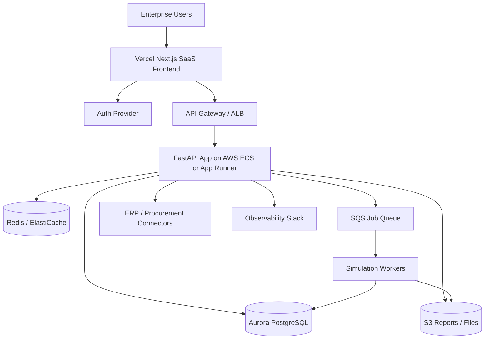

# SaaS Investment Memo — TCO Comparison Model

## 1. End-to-End Review

### Current Comprehensiveness

The project is **highly comprehensive as an analytics product prototype**.

It already includes:
- deterministic lifecycle costing,
- stochastic risk modeling,
- macro scenario analysis,
- financial translation,
- supplier scoring,
- prescriptive optimization,
- engineering benchmarking,
- API delivery,
- data ingestion,
- database design,
- dashboarding,
- and automated testing.

### Overall Assessment

| Category | Assessment |
| --- | --- |
| Analytics sophistication | Excellent |
| Breadth of decision workflows | Strong |
| Technical credibility | Strong |
| Product polish | Good prototype |
| SaaS maturity | Early |
| Investor-grade differentiation | Emerging, but not fully packaged |

### Bottom Line

**Today:** strong prototype / analytics engine.

**Needed for premium SaaS valuation:** multi-tenancy, enterprise workflow, modern frontend, connectors, collaboration, usage-based monetization, and a visible AI/benchmark moat.

## 2. What Makes This Stand Out

### Existing Differentiators
1. 8-layer TCO rather than single landed-cost analysis.
2. Finance translation from operations to NPV / IRR / EBITDA.
3. Scenario + Monte Carlo in one workflow.
4. Prescriptive optimization rather than passive dashboards.
5. Evidence-class tagging for governance.

### Innovation Moves That Create a Stronger Moat
1. **AI Negotiation Copilot**
   - Generate supplier negotiation plans from TCO gaps.
2. **Supplier Dependency Graph**
   - Model disruption propagation across suppliers, regions, and critical parts.
3. **Trigger-Based Scenario Automation**
   - Auto-run scenarios when FX, tariffs, freight, or commodity prices change.
4. **Cross-Tenant Benchmark Intelligence**
   - Anonymous benchmark network that improves as customers join.
5. **Board Memo Generation**
   - Turn analysis into CFO/COO-ready recommendations instantly.
6. **Carbon-Adjusted TCO**
   - Add emissions, carbon price, and sustainability trade-offs.

## 3. SaaS Product Definition

### Product Positioning
An AI-native procurement intelligence platform for capital equipment and strategic sourcing decisions.

### Core Personas
- Chief Procurement Officer
- Category Manager
- CFO / VP Finance
- Plant Engineering / Maintenance Lead
- Supplier Risk / Resilience Manager

### SaaS Modules
- Executive Cockpit
- Scenario Studio
- Supplier Intelligence
- Engineering Reliability
- Finance Translator
- AI Copilot
- Admin / Billing / Integrations

## 4. Vercel + AWS Deployment Strategy

### Vercel Responsibilities
- Next.js web application
- Marketing website
- Auth/session middleware
- Edge caching and global delivery
- Tenant-aware dashboard shell

### AWS Responsibilities
- FastAPI backend services
- Job workers for Monte Carlo / optimization
- RDS/Aurora PostgreSQL
- ElastiCache Redis
- S3 for files/reports
- SQS/EventBridge for async workflows
- CloudWatch/X-Ray for observability
- Secrets Manager / Parameter Store

## 5. Reference Architecture

## 6. What Investors Need to See

### Technical Signals
- Multi-tenant architecture
- Enterprise auth and auditability
- Scalable async compute
- Benchmark data moat
- Security and compliance roadmap

### Commercial Signals
- Clear ICP: manufacturing, industrial procurement, OEMs
- Time-to-value under 14 days
- Measurable savings outcomes
- Tiered pricing and expansion paths
- Integration-led stickiness

## 7. Recommended Pricing Model

| Plan | Price Direction | Includes |
| --- | --- | --- |
| Starter | $1k–$2k / month | CSV upload, limited scenarios, single workspace |
| Growth | $5k–$10k / month | connectors, collaboration, scheduled jobs, exports |
| Enterprise | $30k+ ACV | SSO, audit, benchmarks, private deployment, custom models |

## 8. The $10M Story

To be worth a $10M investment, the company story should be:

> We are not selling a dashboard. We are building the operating system for procurement decisions under uncertainty.

That requires converting this strong model-centric codebase into:
- a repeatable SaaS workflow,
- a benchmark network,
- an AI-assisted recommendation engine,
- and a defensible enterprise integration layer.
