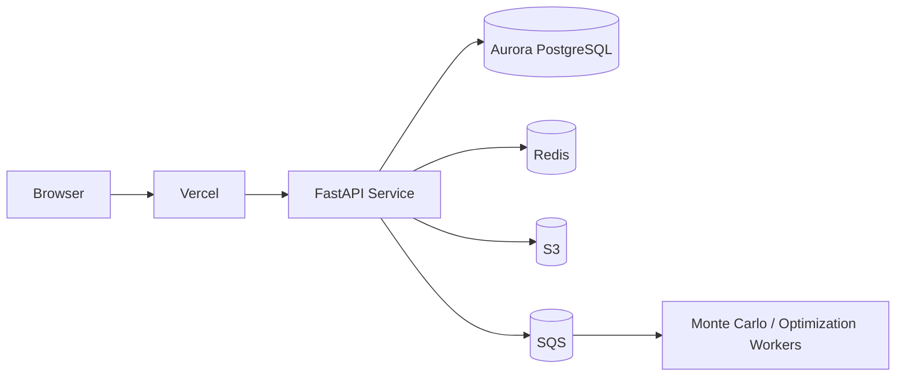

# Deployment Blueprint — Vercel + AWS

## Recommended Split

### Vercel
Use Vercel for the **customer-facing web layer**:
- Next.js frontend
- marketing pages
- docs portal
- tenant-aware dashboard shell
- auth/session middleware
- edge routing

### AWS
Use AWS for the **stateful and compute-heavy backend**:
- FastAPI app service
- background simulation workers
- managed relational database
- queues, cache, file storage, secrets, monitoring

## Why This Split Works

- Vercel is ideal for fast global frontend delivery.
- AWS is ideal for regulated, stateful, heavy-compute workloads.
- Monte Carlo, optimization, and large report generation should not live in edge/serverless frontend runtimes.

## Target AWS Services

| Capability | AWS Service |
| --- | --- |
| API runtime | ECS Fargate or App Runner |
| Database | Aurora PostgreSQL |
| Cache / job state | ElastiCache Redis |
| File storage | S3 |
| Async queue | SQS |
| Scheduled tasks | EventBridge |
| Secrets | Secrets Manager |
| Monitoring | CloudWatch + X-Ray |
| CDN for assets | CloudFront |

## Suggested Runtime Topology

## Minimum Deployment Milestones

### Milestone 1 — Demo Cloud
- Deploy FastAPI via Vercel Python runtime for demos
- Use managed Postgres/MySQL
- Keep Streamlit only for internal showcase

### Milestone 2 — SaaS Beta
- Deploy Next.js on Vercel
- Deploy FastAPI on AWS App Runner / ECS
- Add Redis + S3 + queue-backed jobs
- Add tenant auth and role model

### Milestone 3 — Enterprise Production
- Private subnets and VPC controls
- SSO, SCIM, audit export
- encrypted report storage
- observability and alerting
- DR, backups, and tenant isolation controls

## Environment Variables

### Vercel
- `NEXT_PUBLIC_API_BASE_URL`
- `AUTH_PROVIDER_DOMAIN`
- `AUTH_CLIENT_ID`
- `AUTH_AUDIENCE`

### AWS Backend
- `TCO_DB_HOST`
- `TCO_DB_PORT`
- `TCO_DB_USER`
- `TCO_DB_PASSWORD`
- `TCO_DB_NAME`
- `TCO_API_KEY`
- `TCO_RATE_LIMIT`
- `TCO_RATE_WINDOW`
- `FX_API_KEY`
- `FX_API_URL`
- `REDIS_URL`
- `S3_BUCKET_REPORTS`
- `AWS_REGION`

## Current Repo Support

This repository now includes:
- [api/index.py](../api/index.py) for Vercel ASGI entrypoint
- [vercel.json](../vercel.json) for simple Vercel deployment routing

## Recommended Next Build

The highest-leverage next implementation is:
1. add a Next.js frontend on Vercel,
2. convert authentication to tenant-aware auth,
3. move heavy simulations into async AWS worker jobs,
4. expose job polling/webhooks for enterprise integrations.
